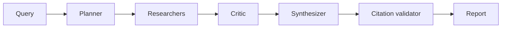

# 01 - LangGraph Research Analyst

[](https://github.com/milos-plavsic/langgraph-research-analyst/actions/workflows/ci.yml)
[](https://www.python.org/downloads/)

An advanced multi-agent research assistant that decomposes broad questions, gathers evidence, critiques weak claims, and produces cited reports with confidence scoring.

## Quickstart

```bash
make install
make run
make api          # http://127.0.0.1:8000/docs
make test
```

Docker API: `make docker-api` (Compose profile `api`).

## API

- OpenAPI docs: `http://127.0.0.1:8000/docs`
- Health: `GET /health`
- End-to-end research run: `POST /v1/research` with JSON body `{"query":"..."}`

## Architecture



## Why This Project Stands Out

- Demonstrates production-style `LangGraph` orchestration.
- Shows robust agent design: planner, researcher, critic, synthesizer.
- Includes evaluability: claim-source linking, confidence metrics, audit traces.

## Core Capabilities

- Query decomposition into sub-questions.
- Parallel evidence collection from approved sources.
- Critic node that detects unsupported claims and requests rework.
- Citation consistency checks before final answer release.
- Human approval gate for high-risk topics.

## Suggested Tech Stack

- Python 3.11+
- `langgraph`, `langchain`, `pydantic`, `httpx`, `duckdb`
- Optional UI: Streamlit
- Optional tracing: LangSmith / OpenTelemetry

## Architecture (Graph)

`ingest_query -> planner -> branch_researchers -> evidence_ranker -> critic -> synthesizer -> citation_validator -> human_gate -> final_report`

## Usage Suggestions

- Use as a research co-pilot for technical docs and market scans.
- Add domain profiles (`healthcare`, `finance`, `devtools`) to tune behavior.
- Keep source allowlists to improve trust and reduce hallucination risk.

## Portfolio Additions

- Add a metrics page:
  - average citations per response
  - unsupported claim rate
  - answer latency and token cost
- Include a short screencast showing critique-triggered rewrites.

## Milestones

- `v0.1`: single-path workflow with citations.
- `v0.2`: multi-agent branching and critique loop.
- `v0.3`: memory + dashboard + human review node.
- `v1.0`: evaluation harness and deployment.

## Demo Scenarios

1. "Compare open-source agent frameworks for enterprise use."
2. "Summarize recent retrieval research and unresolved gaps."
3. "Build a migration recommendation from framework A to B."
