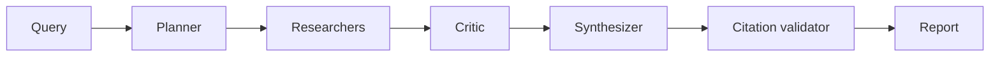

# 01 - LangGraph Research Analyst

[](https://github.com/milos-plavsic/langgraph-research-analyst/actions/workflows/ci.yml)
[](https://www.python.org/downloads/)

An advanced multi-agent research assistant that decomposes broad questions, gathers evidence, critiques weak claims, and produces cited reports with confidence scoring.

## Quickstart

```bash
make install
make run
make api          # http://127.0.0.1:8000/docs
make test
```

Docker API: `make docker-api` (Compose profile `api`).

## API

- OpenAPI docs: `http://127.0.0.1:8000/docs`
- Health: `GET /health`
- End-to-end research run: `POST /v1/research` with JSON body `{"query":"..."}`

## Architecture



## Core Capabilities

- Query decomposition into sub-questions.
- Parallel evidence collection from approved sources.
- Critic node that detects unsupported claims and requests rework.
- Citation consistency checks before final answer release.
- Human approval gate for high-risk topics.

## Architecture (Graph)

`ingest_query -> planner -> branch_researchers -> evidence_ranker -> critic -> synthesizer -> citation_validator -> human_gate -> final_report`
